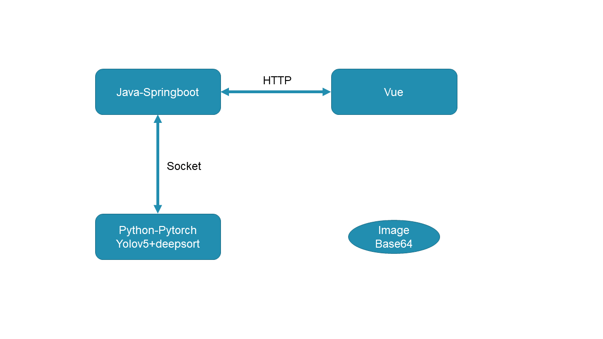

# springboot-vue-pytorch

##
JavaWeb调用深度学习服务得到结果传给前端。
Springboot-pytorch-vue全分离结构，Spring-pytorch之间通过socket通讯，spring-vue之间通过http通讯。可方便部署深度学习服务到大多数场景，且损耗很低。

## Project setup
### Vue install
```
npm install
```
Vue Compiles and hot-reloads for development
```
npm run serve
```

### Springboot
use idea open and run

### Yolo_deepsort
```
cd Yolov5_DeepSort_Pytorch
pip install -r requirements.txt
cd yolov5
pip install -r requirements.txt
```
run
```
python socketapi.py
```



### Results

